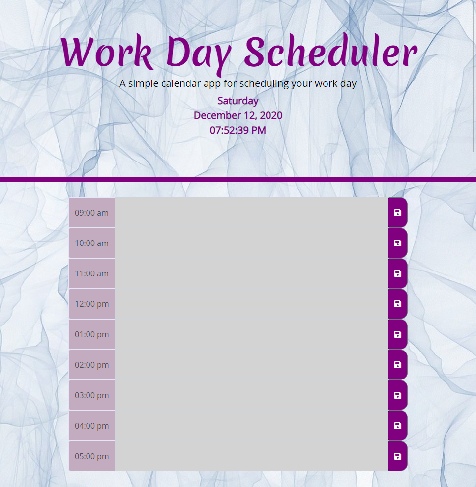
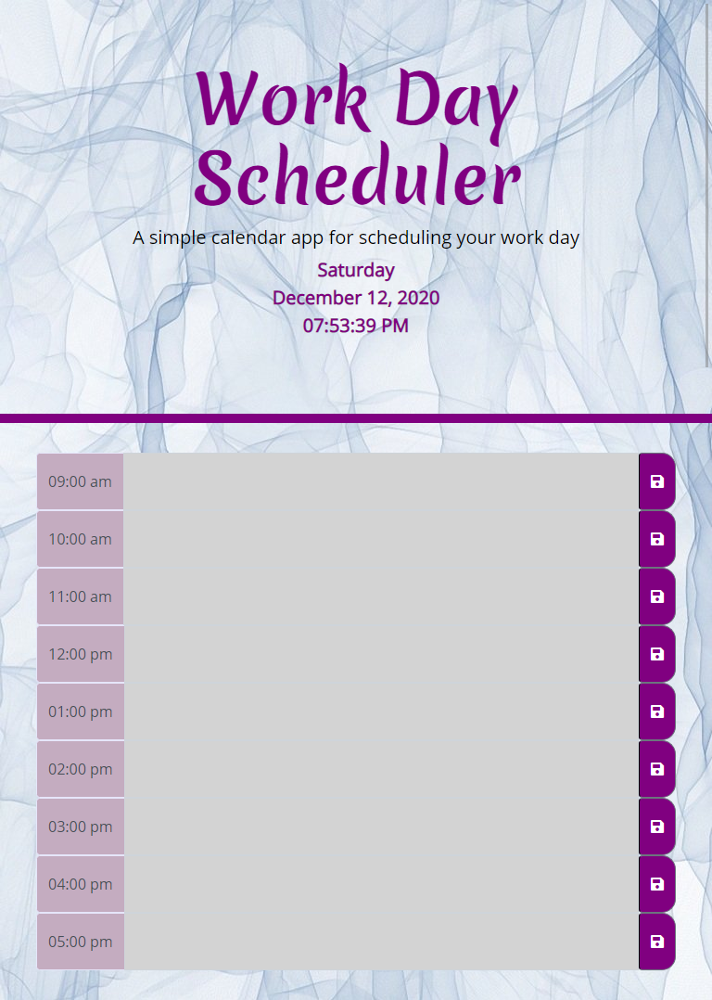
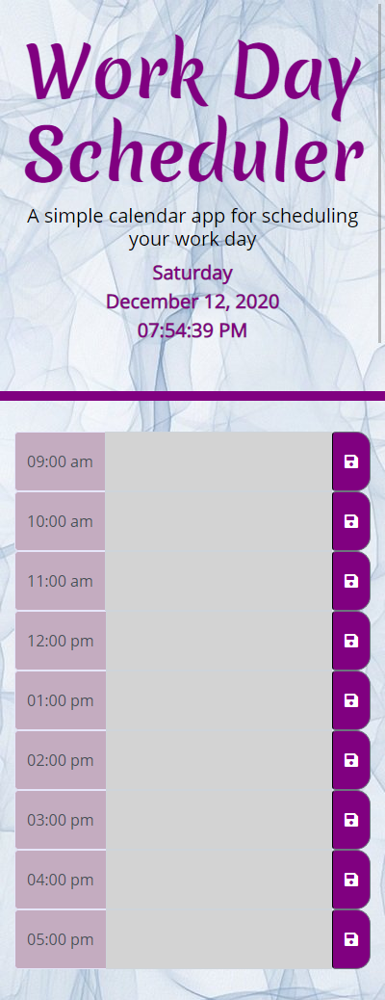

# Work Day Scheduler

This is a simple calendar/schedule8 application that allows a user to save events for each hour of the day by modifying starter code.

## Table of Contents
* [General Information](#general-information)
* [Technology](#technology)
* [Deployment](#deployment)
* [Screenshots](#screenshots)
* [Credits](#credits)
* [License](#license)

## General Information
As an employee having a good daily schedule is a blueprint for a sucessful work life. Knowing what you’re meant to be doing (and when) creates a sense of purpose, meaning, and focus. It helps you avoid procrastination, stay motivated, and properly manage your time. This work day scheduler will keep you on track each work day. You are able to see the time, date and time blocks for traditional work hours (9am - 5pm). The time block are colour-coded based on the current time. If the time is in the past, you will not be able to enter tasks in the time blocks and it will be gray. If the current time and the time block are the same, the colour of that time block will be red. The time block will be green if the time hasn't come yet, signifying future time for that day. At the end of the day(midnight), the tasks/ notes entered for that day are removed from local storage so you have a fresh new start for the next day.

## Technology

The app was made with HTML and CSS. Bootstrap was used to make the UI responsive. JQuery and moment.js was used to dynamically update the  HTML and CSS. For more information on 
moment.js and jQuery, please click the links below.

* [jQuery](https://jquery.com/)
* [Moment.js](https://momentjs.com/docs/)

## Deployment

A web browser is need to view page.

* Github page: 

* To open in a new window, copy and paste: https://

## Screenshots
The user interface is responsive and adapts to all screen sizes. Click on the arrows to drop down images at various screen sizes.

  
Large Screen

  

  
Medium Screen

   

  
Small Screen

   

## Credits

* Carleton University Coding Bootcamp team
* [Adam Simonini](https://github.com/adamsimonini)
* [jQuery.com](https://jquery.com/)
* [Momentjs.com](https://momentjs.com/docs/)

## License 

Copyright © 2020 Nash Walters
